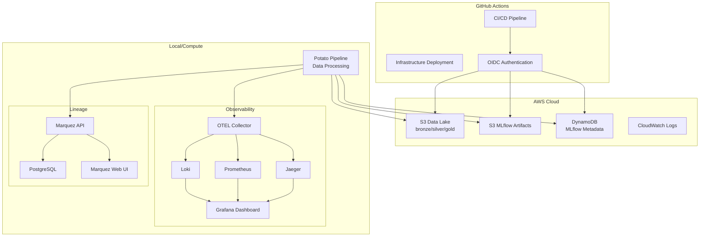

# System Architecture Diagram

## Overview

This document describes the system architecture for the potato-weight-nutrition pipeline, including data flow, infrastructure components, and observability.

## High-Level Architecture

```
┌─────────────────────────────────────────────────────────────────────────────────┐
│                                 GITHUB ACTIONS                                  │
├─────────────────────────────────────────────────────────────────────────────────┤
│  CI/CD Pipeline                     │  Infrastructure Deployment               │
│  ┌─────────────┐  ┌─────────────┐   │  ┌─────────────┐  ┌─────────────┐       │
│  │  Code QA    │  │ Data Quality│   │  │  Terraform  │  │    OIDC     │       │
│  │   • Lint    │  │  • GE Check │   │  │   • Plan    │  │ Trust Policy│       │
│  │   • Test    │  │  • Contracts│   │  │   • Apply   │  │             │       │
│  │   • Security│  │             │   │  │             │  │             │       │
│  └─────────────┘  └─────────────┘   │  └─────────────┘  └─────────────┘       │
└─────────────────────────────────────────────────────────────────────────────────┘
                                      │
                                      ▼ OIDC AssumeRole
┌─────────────────────────────────────────────────────────────────────────────────┐
│                                    AWS CLOUD                                    │
├─────────────────────────────────────────────────────────────────────────────────┤
│                                                                                 │
│  ┌─────────────┐    ┌─────────────┐    ┌─────────────┐    ┌─────────────┐     │
│  │     S3      │    │     S3      │    │  DynamoDB   │    │ CloudWatch  │     │
│  │ Data Lake   │    │   MLflow    │    │   MLflow    │    │    Logs     │     │
│  │             │    │ Artifacts   │    │  Metadata   │    │             │     │
│  │ bronze/     │    │             │    │             │    │             │     │
│  │ silver/     │    │             │    │             │    │             │     │
│  │ gold/       │    │             │    │             │    │             │     │
│  └─────────────┘    └─────────────┘    └─────────────┘    └─────────────┘     │
│                                                                                 │
└─────────────────────────────────────────────────────────────────────────────────┘
                                      │
                                      ▼ Data Processing
┌─────────────────────────────────────────────────────────────────────────────────┐
│                              LOCAL/COMPUTE ENVIRONMENT                          │
├─────────────────────────────────────────────────────────────────────────────────┤
│                                                                                 │
│  ┌─────────────────────────────────────────────────────────────────────────┐   │
│  │                         POTATO PIPELINE                                 │   │
│  │  ┌─────────────┐  ┌─────────────┐  ┌─────────────┐  ┌─────────────┐    │   │
│  │  │   Bronze    │  │   Silver    │  │    Gold     │  │   Reports   │    │   │
│  │  │ Data Load   │→│  Features   │→│  Modeling   │→│ Generation  │    │   │
│  │  │             │  │ Engineering │  │             │  │             │    │   │
│  │  └─────────────┘  └─────────────┘  └─────────────┘  └─────────────┘    │   │
│  │                                                                         │   │
│  │  Emits: Metrics, Logs, Traces, Lineage Events                         │   │
│  └─────────────────────────────────────────────────────────────────────────┘   │
│                                      │                                          │
│                                      ▼                                          │
│  ┌─────────────────────────────────────────────────────────────────────────┐   │
│  │                      OBSERVABILITY STACK                               │   │
│  │                                                                         │   │
│  │  ┌─────────────┐  ┌─────────────┐  ┌─────────────┐  ┌─────────────┐    │   │
│  │  │    OTEL     │  │    Loki     │  │ Prometheus  │  │   Jaeger    │    │   │
│  │  │ Collector   │  │   (Logs)    │  │ (Metrics)   │  │  (Traces)   │    │   │
│  │  └─────────────┘  └─────────────┘  └─────────────┘  └─────────────┘    │   │
│  │                                      │                                  │   │
│  │                                      ▼                                  │   │
│  │  ┌─────────────────────────────────────────────────────────────────┐   │   │
│  │  │                          GRAFANA                                │   │   │
│  │  │                    Unified Dashboard                           │   │   │
│  │  │  • Pipeline Metrics    • Data Quality    • SLO Tracking      │   │   │
│  │  │  • Error Logs          • Freshness       • Alerting          │   │   │
│  │  └─────────────────────────────────────────────────────────────────┘   │   │
│  └─────────────────────────────────────────────────────────────────────────┘   │
│                                                                                 │
│  ┌─────────────────────────────────────────────────────────────────────────┐   │
│  │                       LINEAGE TRACKING                                 │   │
│  │                                                                         │   │
│  │  ┌─────────────┐  ┌─────────────┐  ┌─────────────┐                     │   │
│  │  │ PostgreSQL  │  │   Marquez   │  │  Marquez    │                     │   │
│  │  │ (Metadata)  │  │    API      │  │  Web UI     │                     │   │
│  │  │             │  │ (OpenLine)  │  │ (Lineage)   │                     │   │
│  │  └─────────────┘  └─────────────┘  └─────────────┘                     │   │
│  └─────────────────────────────────────────────────────────────────────────┘   │
└─────────────────────────────────────────────────────────────────────────────────┘
```

## Data Flow Architecture

```
┌─────────────┐    ┌─────────────┐    ┌─────────────┐    ┌─────────────┐
│    CSV      │    │   Bronze    │    │   Silver    │    │    Gold     │
│    Files    │───▶│    Layer    │───▶│   Layer     │───▶│   Layer     │
│             │    │             │    │             │    │             │
│ Raw data    │    │ Ingested    │    │ Features    │    │ Models +    │
│ from study  │    │ as-is       │    │ engineered  │    │ Analysis    │
└─────────────┘    └─────────────┘    └─────────────┘    └─────────────┘
       │                   │                   │                   │
       │                   │                   │                   │
       ▼                   ▼                   ▼                   ▼
┌─────────────┐    ┌─────────────┐    ┌─────────────┐    ┌─────────────┐
│ Validation  │    │ Schema      │    │ Data        │    │ Model       │
│ (Basic)     │    │ Validation  │    │ Contracts   │    │ Validation  │
│             │    │ (GE)        │    │ (GE)        │    │ (Stats)     │
└─────────────┘    └─────────────┘    └─────────────┘    └─────────────┘
```

## Component Details

### Infrastructure Layer (AWS)

#### S3 Data Lake
```
s3://cdp-dev-potato-data-lake-{random}/
├── bronze/                 # Raw data (CSV files)
│   ├── nutrition/
│   ├── weight/
│   └── fiber/
├── silver/                 # Cleaned features
│   ├── weekly_features/
│   ├── subject_trajectories/
│   └── modeling_dataset/
└── gold/                   # Analysis outputs
    ├── models/
    ├── reports/
    └── figures/
```

#### MLflow Storage
```
s3://cdp-dev-mlflow-artifacts-{random}/
├── experiments/
│   ├── 1/                  # Default experiment
│   ├── 2/                  # OLS experiments
│   └── 3/                  # Mixed effects experiments
└── models/
    ├── ols_cluster/
    ├── fixed_effects/
    └── mixed_effects/
```

#### DynamoDB Schema
```
Table: cdp-dev-mlflow-backend
Primary Key: (experiment_id, run_uuid)
Attributes:
  - experiment_id (String)
  - run_uuid (String)  
  - run_name (String)
  - status (String)
  - start_time (Number)
  - end_time (Number)
  - metrics (Map)
  - params (Map)
  - tags (Map)
```

### Pipeline Architecture

#### Processing Stages
```python
# Stage 1: Bronze (Data Ingestion)
CSVLoader()
  .read_nutrition_files()
  .basic_validation()
  .save_to_s3(bronze/)

# Stage 2: Silver (Feature Engineering)  
FeatureEngineer()
  .load_from_bronze()
  .clean_data()
  .engineer_features()
  .validate_schema()
  .save_to_s3(silver/)

# Stage 3: Gold (Modeling & Analysis)
ModelingPipeline()
  .load_features()
  .train_models()
  .generate_reports()
  .save_artifacts()
```

#### Observability Integration
```python
# OpenTelemetry Integration
from opentelemetry import trace, metrics
from openlineage.client import OpenLineageClient

@trace.instrument
@emit_lineage_events
def process_stage(stage_name: str, inputs: List[Dataset], outputs: List[Dataset]):
    """Process pipeline stage with full observability."""
    
    # Metrics
    duration_histogram.record(processing_time)
    rows_counter.add(row_count, {"stage": stage_name})
    
    # Structured logging
    logger.info("stage_completed", 
               stage=stage_name, 
               duration_ms=processing_time,
               rows_processed=row_count,
               status="success")
```

### Observability Stack

#### Metrics Flow
```
Pipeline → OTEL Collector → Prometheus → Grafana
                  ↓
              Alertmanager → PagerDuty/Email
```

#### Logs Flow  
```
Pipeline → OTEL Collector → Loki → Grafana
              ↓
         JSON structured logs with correlation IDs
```

#### Traces Flow
```
Pipeline → OTEL Collector → Jaeger → Grafana
              ↓
         Distributed tracing across pipeline stages
```

#### Lineage Flow
```
Pipeline → OpenLineage Events → Marquez API → PostgreSQL
                                      ↓
                               Marquez Web UI
```

### Security Architecture

#### Authentication Flow
```
GitHub Actions → OIDC Provider → AWS STS → Temporary Credentials
                                     ↓
                                 AssumeRole → Pipeline IAM Role
                                     ↓
                              S3 + DynamoDB Access
```

#### Network Security
```
Internet → GitHub Actions (HTTPS)
              ↓
          AWS API Gateway (TLS 1.2+)
              ↓
          VPC (Private Subnets)
              ↓
          Application Layer
```

## Deployment Patterns

### Local Development
```bash
# 1. Start observability
make obs.up
make lineage.up

# 2. Run pipeline with instrumentation
export OPENLINEAGE_URL=http://localhost:5000
export OTEL_EXPORTER_OTLP_ENDPOINT=http://localhost:4317
make run

# 3. View results
# Grafana: http://localhost:3000
# Marquez: http://localhost:3000 (different stack)
```

### Production Deployment
```bash
# 1. Deploy infrastructure
make infra.apply

# 2. Configure secrets in GitHub
AWS_ROLE_ARN: {from terraform output}
AWS_REGION: us-east-1

# 3. Deploy via GitHub Actions
git push origin main  # Triggers deployment
```

## Scaling Considerations

### Horizontal Scaling
- **Pipeline**: Containerize with Kubernetes
- **Data Processing**: Use Spark for large datasets
- **Storage**: Partition S3 data by date/subject
- **Compute**: Auto-scaling groups with spot instances

### Vertical Scaling  
- **Memory**: Increase for large in-memory operations
- **CPU**: Optimize for statistical computations
- **I/O**: Use SSD storage for temporary processing

### Cost Optimization
- **S3 Lifecycle**: Bronze→IA→Glacier after 30/90 days
- **Spot Instances**: For batch processing workloads
- **Reserved Capacity**: For predictable baseline load
- **Data Compression**: Parquet format for analytics

## Disaster Recovery

### Backup Strategy
```
┌─────────────┐    ┌─────────────┐    ┌─────────────┐
│  Primary    │    │   Backup    │    │   Archive   │
│   Region    │───▶│   Region    │───▶│   Glacier   │
│ (us-east-1) │    │ (us-west-2) │    │ (1+ years)  │
└─────────────┘    └─────────────┘    └─────────────┘
      │                   │                   │
   Real-time         15-min delay         24-hour delay
```

### Recovery Procedures
1. **RTO (Recovery Time Objective)**: 4 hours
2. **RPO (Recovery Point Objective)**: 1 hour  
3. **Failover**: Automated DNS switching
4. **Data Sync**: Cross-region S3 replication

## Creating the Visual Diagram

To create the actual system diagram image (`system-diagram.png`):

### Recommended Tools
1. **draw.io** (online): https://app.diagrams.net/
2. **Lucidchart**: Professional diagramming
3. **Mermaid**: Code-based diagrams
4. **PlantUML**: Text-to-diagram generation

### Mermaid Code (for automated generation)


Save this as `ops/system-diagram.mmd` and generate PNG using:
```bash
# Install mermaid CLI
npm install -g @mermaid-js/mermaid-cli

# Generate diagram
mmdc -i ops/system-diagram.mmd -o ops/system-diagram.png
```

---

📊 **Diagram Status**: Text version complete, visual PNG to be generated  
🔄 **Last Updated**: 2024-09-23  
👤 **Maintained By**: Data Engineering Team