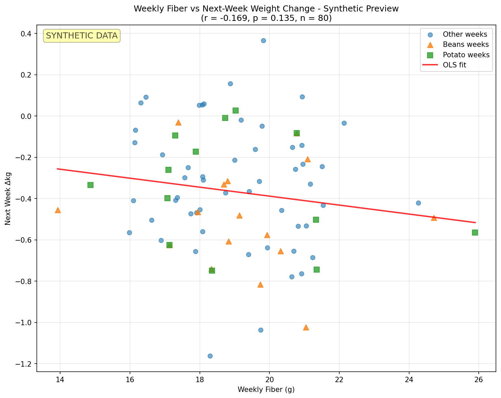

# Potato Weight-Nutrition Analysis Pipeline

A complete, reproducible data science pipeline for analyzing weight change patterns in relation to dietary fiber intake and specific food categories (potatoes, beans, etc.).



## Pipeline Overview

This pipeline transforms messy nutritional data into insights about weight change patterns using robust statistical methods.

```
Raw Data (Excel) → Cleaned CSVs → Features → Statistical Models → Insights
     ↓                ↓             ↓            ↓               ↓
  Messy nutritional   Tidy tables   Weekly      OLS, Mixed     Publication-ready
  & weight tracking   with proper   aggregates  Effects,       figures & tables
                      data types    & keywords  Correlations
```

### Pipeline Stages

1. **Data Loading**: Robust CSV import with type checking and date parsing
2. **Feature Engineering**: 
   - Weight trajectory calculation (deltas, percent changes, OLS slopes)
   - Food keyword extraction (11 categories with regex matching)
   - Daily-to-weekly aggregation with calendar alignment
3. **Statistical Modeling**:
   - OLS with cluster-robust standard errors
   - Within-subject fixed effects (demeaning)
   - Mixed effects models (random intercepts)
   - Nonparametric comparisons (Mann-Whitney U)
4. **Visualization**: Publication-ready matplotlib figures with proper statistical annotation

## Real-Data Hygiene

### Messy → Tidy → Features

- **Missing data policy**: Preserve gaps in nutrition data (no forward-filling); treat zeros as missing for end-phase weight measurements only
- **Date alignment**: Calendar weeks mapped to study weeks using subject-specific baselines
- **Outlier handling**: Robust regression methods with cluster-adjusted standard errors
- **Zero-as-missing rules**: Applied selectively based on measurement context (weight end-phases vs. baseline)

### Data Quality Assurance

- Type-safe data loading with pandas dtypes
- Graceful handling of missing files (empty DataFrames + warnings)
- Comprehensive logging throughout pipeline
- Robust error handling (individual failures don't crash pipeline)

## Statistical Choices

### Primary Models

1. **OLS with Cluster-Robust Standard Errors**
   ```
   Δkg_next ~ fiber_g_week + calories_week + beans_week + potato_week + C(subject_id)
   ```
   - Accounts for within-subject correlation
   - Fixed effects for subject-level confounders
   - [statsmodels documentation](https://www.statsmodels.org/stable/regression.html)

2. **Within-Subject Fixed Effects** 
   - Variables demeaned within subject to remove time-invariant confounders
   - Identifies effects from within-person variation only
   - Distribution of subject-specific coefficients reported

3. **Mixed Effects Models** (when available)
   - Random intercepts by subject
   - Handles unbalanced panels gracefully
   - [statsmodels MixedLM](https://www.statsmodels.org/stable/mixed_linear.html)

### Nonparametric Methods

- **Spearman correlations**: Robust to non-linear relationships
- **Mann-Whitney U tests**: Compare food category weeks without distributional assumptions
- Used to validate parametric model findings

## Quick Start

```bash
# Setup
make setup

# Generate teaser plot (works with or without real data)
make teaser

# Run full pipeline (if cleaned CSVs exist)
make run
```

### Expected Input Files

The pipeline expects cleaned data files at:
```
~/Downloads/Potato Raw Dato/_clean/
├── Potato_tidy.csv              # Weight/energy/mood measurements
├── Potato_nutrition_rows.csv    # Daily food entries with nutrients
└── Potato_fiber_daily.csv       # Daily fiber/calorie rollups
```

### Output Structure

```
reports/
├── figs/
│   ├── teaser.png                    # Main result visualization
│   ├── subject_weight_*.png          # Individual trajectories
│   └── calories_vs_delta_multiples.png
└── analysis/
    ├── weight_trajectories.csv       # Per-subject weekly weights
    ├── nutrition_weekly.csv          # Weekly nutrition aggregates
    ├── analysis_df.csv               # Merged modeling dataset
    └── ols_results.txt               # Statistical model summaries
```

## Development

### Testing
```bash
make test     # Run test suite
make lint     # Code quality checks
```

### Key Tests
- **Keyword extraction**: Case-insensitive regex matching for 11 food categories
- **Week alignment**: Calendar date → study week mapping with multiple subjects
- **Statistical robustness**: Missing data handling, edge cases

### Code Quality
- **Type hints**: Full typing with pydantic configuration
- **Modular design**: Separate modules for I/O, features, modeling, plotting
- **Logging**: Comprehensive loguru-based logging
- **Pre-commit hooks**: Automated formatting and linting

## Food Categories

The pipeline extracts these food categories using case-insensitive regex with word boundaries:

| Category | Examples |
|----------|----------|
| **Potato** | potato, potatoes, baked potato, mashed |
| **Beans** | beans, black bean, chickpea, lentils |
| **Rice** | rice, brown rice, wild rice, jasmine |
| **Oats** | oats, oatmeal, steel cut |
| **Bread** | bread, toast, bagel, whole wheat |
| **Fruit** | fruit, apple, banana, berries |
| **Vegetables** | vegetables, carrot, broccoli, spinach |
| **Dairy** | dairy, milk, cheese, yogurt |
| **Meat** | meat, chicken, fish, salmon |
| **Egg** | eggs, scrambled, omelet |
| **Nuts** | nuts, almond, walnut, cashew |

## Technology Stack

- **Python 3.11**: Type hints, modern syntax
- **Data**: pandas, numpy, pyarrow (Parquet)
- **Statistics**: scipy, statsmodels (OLS, mixed effects)
- **Visualization**: matplotlib (publication-ready, no seaborn)
- **CLI**: typer for command interface
- **Config**: pydantic for type-safe settings
- **Logging**: loguru for structured logging
- **Testing**: pytest with comprehensive coverage
- **CI/CD**: GitHub Actions, pre-commit hooks

## Contributing

1. Fork and clone the repository
2. Run `make setup` to install dependencies
3. Create feature branch
4. Add tests for new functionality
5. Ensure `make test` and `make lint` pass
6. Submit pull request

## License

MIT License - see [LICENSE](LICENSE) for details.