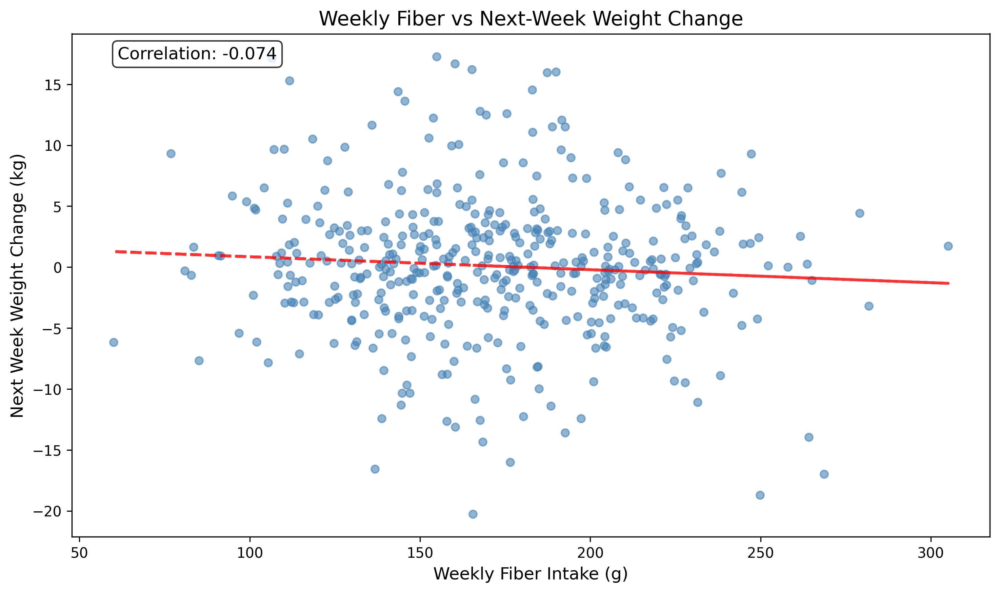

# Potato Weight-Nutrition Analysis Report

Generated: 2025-09-28 15:50:58

## Summary

This report presents the results of analyzing the relationship between dietary fiber intake and weight change patterns.

## Figures

### Main Results

*Weekly fiber intake versus next-week weight change*

## Statistical Models

### OLS Model

- Observations: 436
- R-squared: 0.0209

**Fiber Coefficient**: -0.0160
**P-value**: 0.0274

### FE Model

- Observations: 436
- R-squared: 0.0251

**Fiber Coefficient**: -0.0177
**P-value**: 0.0190

## Methods

- **Data Processing**: Weekly aggregation with subject baselines
- **Feature Engineering**: Food keyword extraction, weight trajectories
- **Statistical Models**: OLS with cluster-robust SE, fixed effects, mixed effects
- **Visualization**: Publication-ready matplotlib figures
